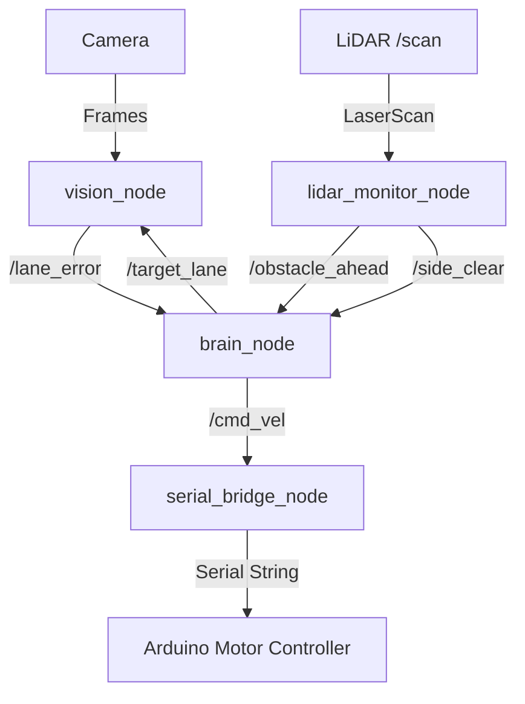

# Robot Navigation ROS 2 Package

An autonomous vehicle navigation system implemented in ROS 2 Jazzy. The package coordinates camera-based lane tracking and LiDAR-based obstacle detection/avoidance to compute steering and throttle outputs, sending commands to an Arduino-based motor controller over serial.

## System Architecture



### Node Descriptions
1. **`vision_node`**: Captures frames from a camera (supports `webcam` and `picamera2`), performs image processing (Perspective Warp, adaptive thresholding, component clustering, and polyfit), computes the deviation from the lane center, and publishes the lane error. It also hosts an embedded HTTP MJPEG Streamer and Web Tuner (default port 8080) for live parameter tuning.
2. **`lidar_monitor_node`**: Monitors laser scan readings to check for obstacles directly in front of the vehicle and clear paths on the right side.
3. **`brain_node`**: A state machine that executes PID-based lane following and obstacles nudges (moving between Lane 1 and Lane 2).
4. **`serial_bridge_node`**: Receives target velocities (`cmd_vel`), performs differential drive kinematics, converts speeds to PWM values, and transmits them to the Arduino.

---

## Hardware Configuration

### Arduino Motor Controller (BTS7960)
The vehicle's DC motors are driven using two **BTS7960 H-Bridge** drivers connected to the Arduino.

#### Wiring Diagram
| BTS7960 Driver Pin | Arduino Pin | Description |
|---|---|---|
| **RPWM_L** (Left Forward PWM) | `D5` | Left motor forward speed controller (PWM) |
| **LPWM_L** (Left Reverse PWM) | `D6` | Left motor reverse speed controller (PWM) |
| **R_EN_L** / **L_EN_L** | `D2` / `D3` | Enable left driver (Active HIGH) |
| **RPWM_R** (Right Forward PWM) | `D10` | Right motor forward speed controller (PWM) |
| **LPWM_R** (Right Reverse PWM) | `D11` | Right motor reverse speed controller (PWM) |
| **R_EN_R** / **L_EN_R** | `D12` / `D13` | Enable right driver (Active HIGH) |
| **GND** | `GND` | Ground connection |

#### Arduino Serial Protocol
* **Baudrate**: `115200`
* **Format**: `<L:left_pwm,R:right_pwm>\n`
* **Range**: `-255` to `255` (Negative: Reverse, Positive: Forward)

---

## Parameter Configuration

All parameters are configured in a single YAML file: **`config/robot_params.yml`**.

```yaml
serial_bridge_node:
  ros__parameters:
    port: "/dev/ttyACM0"            # Arduino serial port path
    baudrate: 115200                # Serial baudrate
    wheel_separation: 0.2           # Track width between wheels in meters
    max_pwm: 255                    # Maximum speed saturation value
    speed_to_pwm_factor: 500.0      # Multiplier to scale m/s speed to PWM

brain_node:
  ros__parameters:
    kp: 0.005                       # Proportional gain for steering control
    kd: 0.001                       # Derivative gain for steering control
    base_speed: 0.3                 # Linear forward velocity (m/s)
    nudge_duration: 1.2             # Lane nudge duration in seconds

lidar_monitor_node:
  ros__parameters:
    front_danger_zone: 0.6          # Front collision distance threshold in meters
    side_safe_zone: 0.8             # Safe side clearance distance in meters
    scan_topic: "/scan"             # LiDAR laser scan topic name

vision_node:
  ros__parameters:
    video_device: 0                 # OpenCV camera device index
    target_lane: 1                  # Default tracking lane (1: Right, 2: Left)
    camera_source: "webcam"         # Source type: 'webcam' or 'picamera'
    camera_rotate_180: false        # Rotate camera feed 180 degrees
    stream_enabled: true            # Enable HTTP MJPEG streamer / Web Tuner
    stream_port: 8080               # Port for the Web Tuner UI
    jpeg_quality: 80                # JPEG encoding quality for the stream
    lidar_overlay_enabled: true     # Enable 2D radar inset in HUD
    lidar_max_range_mm: 6000.0      # Max range for LiDAR inset visualization
    lidar_inset_size_px: 220        # Size of the LiDAR inset widget
```

---

## Build Instructions

1. Source your ROS 2 underlay:
   ```bash
   source /opt/ros/jazzy/setup.bash
   ```

2. Clone/move the package into your ROS 2 workspace (e.g., `~/autonomous_car_workspace/src/`).

3. Resolve dependencies using `rosdep`:
   ```bash
   cd ~/autonomous_car_workspace
   rosdep install --from-paths src --ignore-src -y
   ```

4. Build the package:
   ```bash
   colcon build --packages-select robot_navigation
   ```

---

## Running the System

### 1. Launch All Nodes
To run the full navigation stack using the default parameter configurations:
```bash
# Source workspace overlay
source ~/autonomous_car_workspace/install/setup.bash

# Run launch file
ros2 launch robot_navigation nav_launch.py
```

### 2. Override Configurations
You can specify a custom parameter file when launching:
```bash
ros2 launch robot_navigation nav_launch.py params_file:=/path/to/your/custom_params.yml
```

### 3. Dynamic Reconfiguration (Runtime Tuning)
You can tune the parameters dynamically while the system is running using `ros2 param` or the **Web Tuner UI**.

* **Access Web Tuner UI**:
  Open your browser and navigate to `http://<robot-ip>:8080/`. From there you can view the live annotated camera feed and adjust thresholding/lane detection parameters in real time.

* **Modify PID Gains (Brain Node)**:
  ```bash
  ros2 param set /brain_node kp 0.007
  ros2 param set /brain_node kd 0.002
  ```
* **Alter Base Speed**:
  ```bash
  ros2 param set /brain_node base_speed 0.4
  ```
* **Switch Camera Input Device**:
  ```bash
  ros2 param set /vision_node camera_source "picamera"
  ros2 param set /vision_node video_device 1
  ```

### 4. Web Dashboard & Remote Monitoring
The external Next.js dashboard requires `rosbridge_server` to communicate with the ROS 2 workspace via WebSockets.

1. **Install `rosbridge-suite`** (if not installed):
   ```bash
   sudo apt install ros-jazzy-rosbridge-suite
   ```
2. **Launch the WebSocket server** alongside your navigation stack:
   ```bash
   ros2 launch rosbridge_server rosbridge_websocket_launch.xml
   ```
3. **Run the Dashboard** (can be done on any computer on the same network):
   ```bash
   cd ~/dashboard
   npm run dev
   ```
4. **Connect**: Open `http://localhost:3000` in your browser. In the top connection bar, change `localhost` to your robot's IP address (e.g., `ws://192.168.1.50:9090`) and click Connect.
